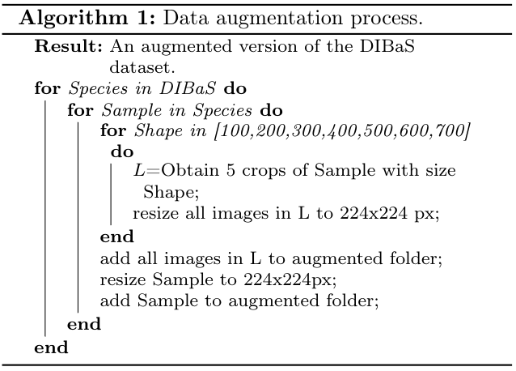
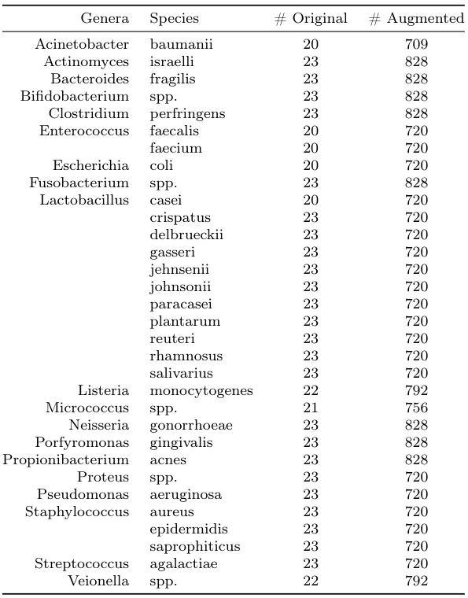
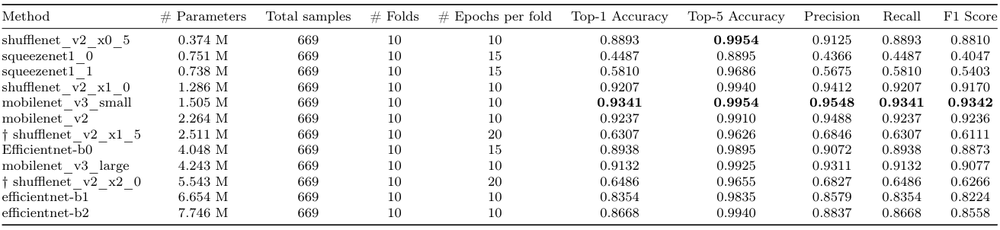
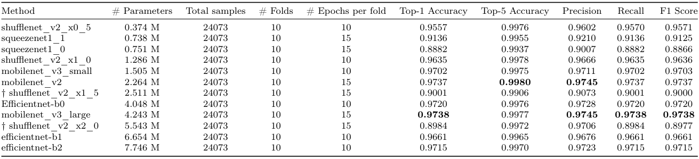

# Efficient and Mobile Deep Learning Architectures for Fast Identification of Bacterial Strains in Resource-Constrained Devices: Code and instructions.
Repository for the paper: [Efficient and Mobile Deep Learning Architectures for Fast Identification of Bacterial Strains in Resource-Constrained Devices](https://gallardorafael.github.io/assets/docs/DRAFT_EffMobDIBaS.pdf)

Authors: Rafael Gallardo García, Sofía Jarquín Rodríguez, Beatriz Beltrán Martínez, Rodolfo Martínez Torres, Carlos Hernández Gracidas

Note: We highly recommend reading the paper to get a deeper understanding of the work.

## Requirements
Hardware:

- A CUDA capable GPU is recommended.
- At least 15 GB of storage.

Software:

- Python 3.8.5
- matplotlib 3.3.0
- torch 1.5.1
- torchvision 0.6.1
- scikit-learn==0.23.2
- numpy 1.19.1
- seaborn 0.10.1
- efficientnet-pytorch==0.7.0
- Pillow==7.2.0
- Jupyter (to open and run notebooks)

We are also adding a requirements.txt file, but it is not optimized (yet), so may be it will install some not useful stuff. To install from the requirements file (we recommend using a virtual environment):
```
pip3 install -r requirements.txt
```


## Digital Image of Bacterial Species (DIBaS) dataset
The original version of DIBaS dataset contains a total of 33 species of microorganisms, approximately 20 RGB images (of 2048x1532 pixels) per specie. We remove the set of images of Candida albicans colonies as it is considered fungi. The dataset was collected by the Chair of Microbiology of the Jagiellonian University in Krakow. The samples were stained using the Gramm’s method. All images were taken with an Olympus CX31 Upright Biological Microscope and a SC30 camera with a 100 times objective under oil-immersion. The DIBaS dataset is publicly available in the following [link](http://misztal.edu.pl/software/databases/dibas/).

It is recommended to put the data into the Dataset/ folder. The Jupyter Notebooks use defined paths to load the files, but you can modify it to your needs.

## Augmented version of the DIBaS dataset
Our data augmentation strategy is aimed to provide atleast 35 different images per each sample in the orig-inal dataset. The proposed approach tries to simulate different levels of zoom for the same bacterial sample,which is achieved by cropping different regions of different sizes of the full image. The full process is described in the following algorithm:



We provide a script to augment the dataset in the same way. It is available on: Dataset/augment_dataset.py, you can augmente your data as follows:
```
cd Dataset/
python3 augment_dataset.py --input_dir DIBaS/ --output_dir DIBaS_augmented --size 224
```

The following table shows the distribution of samples before and after the augmentation.



The next figure illustrates a sample of the DIBaS dataset, after applying our augmentation method:


## Examples and code: The jupyter Notebook
We provide two Jupyter Notebooks per each architecture: one for each version of the dataset. The names are standardized in order to easily find the desired notebook:

1. An * at the beginning of the name indicates that the model in that notebook was trained from scratch (i.e do not use transfer-learning),
2. Notebooks with the 'original_' prefix indicates that the experiments on that notebook use the original version of the dataset,
3. Notebooks with the 'augmented_' prefix indicates that the experiments on that notebook use the augmented version of the dataset,
4. All words after prefix correspond to the name of the architecture in the notebook.

List of architectures and names:
- shufflenet_v2_x0_5
- squeezenet1_1
- squeezenet1_0
- shufflenet_v2_x1_0
- mobilenet_v3_small
- mobilenet_v2
- shufflenet_v2_x1_5
- efficientnet-b0
- mobilenet_v3_large
- shufflenet_v2_x2_0
- efficientnet-b1
- efficientnet-b2

### How to run:
If you installed all the requirements, you should be able to run every notebook just by running a Jupyter server in your python environment:
```
jupyter notebook
```

## Results
The following tables summarize the results of all experiments. The columns have the following information:
1. Name of the architecture
2. Number of trainable parameters in the network
3. Total samples in the dataset
4. Number of folds in cross-validation
5. Number of epochs per fold
6. Top-1 accuracy average of the 10-folds
7. Top-5 accuracy average of the 10-folds
8. Precision average of the 10-folds
9. Recall average of the 10-folds
10. F1 score average of the 10-folds

List of architectures and their results when using cross-validation in the original dataset (notebooks with 'original_' prefix):



List of architectures and their results when using cross-validation in the augmented dataset (notebooks with 'augmented_' prefix):



## Citations
If you use/modify our code:
```
@inproceedings{gallardo2020bacterialident,
	title={Deep Learning for Fast Identification of Bacterial Strains in Resource Constrained Devices},
	author={Rafael Gallardo-García, Sofía Jarquín-Rodríguez, Beatriz Beltrán-Martínez and Rodolfo Martínez},
	booktitle={Aplicaciones Científicas y Tecnológicas de las Ciencias Computacionales},
	pages={67--78},
	year={2020},
	organization={BUAP}
}
```
If you use the DIBaS dataset, please cite the authors as following:
```
@article{zielinski2017,
	title={Deep learning approach to bacterial colony classification},
	author={Zieli{\'n}ski, Bartosz and Plichta, Anna and Misztal, Krzysztof and Spurek, Przemys{\l}aw and Brzychczy-W{\l}och, Monika and Ocho{\'n}ska, Dorota},
	journal={PloS one},
	volume={12},
	number={9},
	pages={e0184554},
	year={2017},
	publisher={Public Library of Science San Francisco, CA USA}
}
